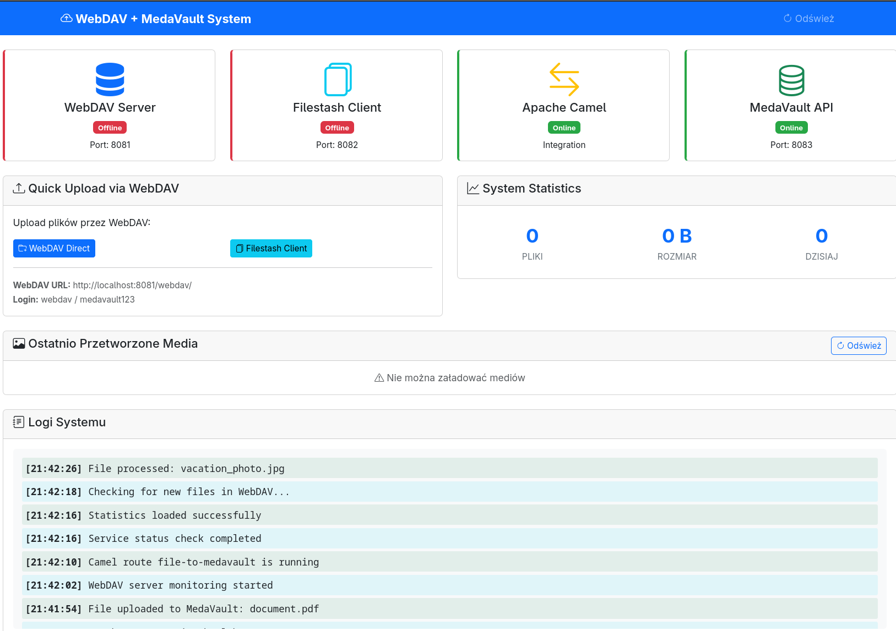

# MedaVault - Secure Media Management System

🌐 A complete media management system with WebDAV support, Apache Camel integration, and a modern web interface.

## 🎯 System Architecture

```
┌─────────────────┐    ┌──────────────────┐    ┌─────────────────┐    ┌──────────────────┐
│   Web Users     │    │  Filestash Web   │    │   Apache Camel  │    │   MedaVault      │
│                 │───▶│     Client       │    │   Integration   │───▶│   Photo Vault    │
│  (Upload files) │    │  (WebDAV GUI)    │    │   (Processing)  │    │   (Storage)      │
└─────────────────┘    └──────────────────┘    └─────────────────┘    └──────────────────┘
                                │                        │
                                ▼                        ▼
                       ┌──────────────────┐    ┌─────────────────┐
                       │   WebDAV Server  │    │   PostgreSQL    │
                       │   (nginx)        │    │   Database      │
                       │   Port: 8081     │    │   (Metadata)    │
                       └──────────────────┘    └─────────────────┘
```

## 🚀 System Components

### 1. **WebDAV Server** (nginx) - Port 8081
- Secure WebDAV server with authentication
- File upload/download via WebDAV protocol
- Integration with Filestash and Camel
- Supports multiple concurrent connections

### 2. **Filestash Web Client** - Port 8082
- Modern web-based file manager
- Supports multiple protocols: WebDAV, S3, SFTP, Git, and more
- Drag & drop file uploads
- File previews and thumbnails
- Open source (AGPL-3.0)

### 3. **Apache Camel Integration**
- Monitors WebDAV for new files
- Processes media files (images, videos, documents)
- Generates thumbnails and extracts metadata
- Routes files to appropriate storage
- Handles error conditions and retries

### 4. **MedaVault Backend API** - Port 8083
- RESTful API for media management
- PostgreSQL database for metadata
- User authentication and authorization
- Media processing and transformation
- Search and filtering capabilities

### 5. **Web Dashboard** - Port 8085
- System monitoring and statistics
- Media gallery and preview
- User and permission management
- Real-time logs and notifications

## 🚀 Quick Start

### Prerequisites
- Docker 20.10.0+
- Docker Compose 2.0.0+
- 4GB RAM (minimum)
- 10GB free disk space

### 1. Clone and Setup
```bash
# Clone the repository
git clone https://github.com/wronai/mediacamel.git
cd mediacamel

# Copy and configure environment variables
cp .env.example .env
# Edit .env file if needed

# Make setup script executable
chmod +x setup.sh
```

### 2. Start the System
```bash
# Build and start all services
./setup.sh
```

### 3. Access the Services
- **🌐 Web Dashboard:** http://localhost:8085
- **📁 WebDAV Server:** http://localhost:8081
- **🖥️ Filestash Client:** http://localhost:8082
- **🔧 API Documentation:** http://localhost:8083/api-docs

### 4. WebDAV Credentials
```
URL: http://localhost:8081
Username: webdav
Password: medavault123
```

### 5. Test the Connection
```bash
# Run the test script
./scripts/test-webdav.sh
```

## 📤 Sposoby Upload-u Plików

### 1. **Przez Filestash (Najłatwiejszy)**
1. Otwórz http://localhost:8082
2. Wybierz "WebDAV" jako storage type
3. Podaj dane logowania WebDAV
4. Przeciągnij i upuść pliki

### 2. **Bezpośrednio przez WebDAV**
```bash
# Przy użyciu curl
curl -u webdav:medavault123 \
     -T twoj-plik.jpg \
     "http://localhost:8081/webdav/twoj-plik.jpg"

# Przy użyciu rclone
rclone copy lokalny-folder/ webdav-remote:
```

### 3. **Mount jako dysk (Windows/macOS/Linux)**
```bash
# Linux (davfs2)
mount -t davfs http://localhost:8081/webdav /mnt/webdav

# Windows - Map Network Drive
\\localhost@8081\webdav

# macOS - Finder -> Go -> Connect to Server
http://localhost:8081/webdav/
```

## 🔄 Jak działa przetwarzanie

1. **Upload:** Użytkownik przesyła plik przez WebDAV
2. **Detection:** Camel polling wykrywa nowy plik
3. **Download:** Camel pobiera plik z WebDAV
4. **Processing:**
   - Obrazy: generowanie miniatur
   - Wideo: ekstrakcja metadanych
   - Dokumenty: indeksowanie treści
5. **Storage:** Plik trafia do MedaVault
6. **Cleanup:** Opcjonalne usunięcie z WebDAV




## 📁 Struktura Projektu

```
webdav-camel-medavault-system/
├── docker-compose.yml           # Główna konfiguracja
├── config/                      # Konfiguracje
│   ├── webdav-nginx.conf       # WebDAV server config
│   ├── application.properties   # Camel properties
│   └── init-db.sql             # Database schema
├── camel-integration/           # Apache Camel
│   └── CamelWebDAVProcessor.groovy
├── medavault-backend/           # Node.js API
│   ├── server.js
│   └── package.json
├── web-dashboard/               # Frontend dashboard
│   ├── index.html
│   ├── css/dashboard.css
│   └── js/dashboard.js
├── storage/                     # File storage
│   ├── incoming/               # WebDAV files
│   ├── processed/              # Processed media
│   └── failed/                 # Failed processing
├── scripts/                     # Helper scripts
│   ├── start-system.sh
│   ├── stop-system.sh
│   ├── test-upload.sh
│   └── monitor-logs.sh
└── logs/                       # System logs
```

## 🛠️ Zarządzanie Systemem

### Monitoring
```bash
# Sprawdź status usług
./scripts/monitor-logs.sh

# Dashboard systemowy
open http://localhost:8080

# Logi Docker
docker-compose logs -f
```

### Testing
```bash
# Test upload functionality
./scripts/test-upload.sh

# Manual file upload
echo "test content" > test.txt
curl -u webdav:medavault123 \
     -T test.txt \
     "http://localhost:8081/webdav/test.txt"
```

### Maintenance
```bash
# Restart specific service
docker-compose restart camel-integration

# Clean up storage
rm -rf storage/processed/*
rm -rf storage/failed/*

# Stop system
./scripts/stop-system.sh
```

## ⚙️ Konfiguracja

### WebDAV Authentication
Edytuj `config/.htpasswd` aby zmienić dane logowania:
```bash
# Generate new password hash
htpasswd -n username
```

### Camel Processing Rules
Edytuj `config/application.properties`:
```properties
# Poll interval (milliseconds)
poll.interval=10000

# Auto cleanup WebDAV files
auto.cleanup=true

# Supported file types
supported.image.types=jpg,jpeg,png,gif,bmp,tiff,webp,svg
supported.video.types=mp4,avi,mov,wmv,flv,mkv,webm,m4v
```

### MedaVault Storage
Konfiguracja lokalizacji storage w `medavault-backend/server.js`:
```javascript
const STORAGE_CONFIG = {
    images: './processed/images',
    videos: './processed/videos',
    documents: './processed/documents',
    thumbnails: './processed/thumbnails'
};
```

## 🔧 API Endpoints

### MedaVault API (Port 8083)
```bash
# Get all media
GET /api/media

# Get media by type
GET /api/media?type=image&limit=10

# Get specific media
GET /api/media/{id}

# Download media
GET /api/media/{id}/download

# Get thumbnail
GET /api/media/{id}/thumbnail

# System statistics
GET /api/stats

# Health check
GET /health
```

### WebDAV API (Port 8081)
```bash
# List files
PROPFIND /webdav/

# Upload file
PUT /webdav/filename.jpg

# Download file
GET /webdav/filename.jpg

# Delete file
DELETE /webdav/filename.jpg

# Create directory
MKCOL /webdav/newfolder/
```

## 🚨 Troubleshooting

### Camel nie wykrywa plików
```bash
# Sprawdź logi Camel
docker-compose logs camel-integration

# Zweryfikuj połączenie z WebDAV
curl -u webdav:medavault123 \
     -X PROPFIND \
     "http://localhost:8081/webdav/"
```

### Filestash nie łączy się z WebDAV
1. Sprawdź czy WebDAV server działa: http://localhost:8081/status
2. Zweryfikuj dane logowania
3. Sprawdź CORS headers w nginx config

### Upload fails
```bash
# Check WebDAV permissions
docker-compose exec webdav-server ls -la /var/www/webdav

# Check storage space
df -h storage/
```

### Database connection issues
```bash
# Restart database
docker-compose restart medavault-db

# Check database logs
docker-compose logs medavault-db
```

## 📊 Performance & Scaling

### File Processing Performance
- **Images:** ~100ms per thumbnail
- **Videos:** ~2-5s per file (metadata extraction)
- **Documents:** ~50ms per file
- **Concurrent Processing:** 5 files simultaneously

### Storage Recommendations
- **Development:** 10GB+ free space
- **Production:** 100GB+ with backup
- **Database:** SSD recommended for metadata

### Scaling Options
1. **Horizontal:** Multiple Camel instances
2. **Storage:** External S3/MinIO backend
3. **Database:** PostgreSQL cluster
4. **Load Balancing:** nginx upstream

## 🔒 Security

### Production Deployment
1. **HTTPS:** Enable SSL certificates
2. **Authentication:** Replace basic auth with OAuth/LDAP
3. **Network:** Firewall rules, VPN access
4. **Backup:** Regular database and storage backups

### Security Headers
```nginx
add_header X-Frame-Options SAMEORIGIN;
add_header X-Content-Type-Options nosniff;
add_header X-XSS-Protection "1; mode=block";
```

## 📈 Monitoring & Alerting

### Metrics to Monitor
- WebDAV upload success rate
- Camel processing latency
- Database connection health
- Storage space utilization
- Failed processing count

### Log Aggregation
```bash
# Centralized logging with ELK stack
docker-compose logs | logstash -f logstash.conf
```

## 🤝 Contributing

1. Fork the repository
2. Create feature branch
3. Make changes
4. Test thoroughly
5. Submit pull request

## 📝 WebDAV Connection Instructions and Usage Guide

### Connecting to WebDAV

To connect to the WebDAV server, use the following URL: `http://localhost:8081/webdav/`

### Uploading Files

To upload a file, use the `PUT` method with the file path as the request body. For example:
```bash
curl -u webdav:medavault123 \
     -T test.txt \
     "http://localhost:8081/webdav/test.txt"
```

### Downloading Files

To download a file, use the `GET` method with the file path as the request URL. For example:
```bash
curl -u webdav:medavault123 \
     "http://localhost:8081/webdav/test.txt"
```

### Deleting Files

To delete a file, use the `DELETE` method with the file path as the request URL. For example:
```bash
curl -u webdav:medavault123 \
     -X DELETE \
     "http://localhost:8081/webdav/test.txt"
```

## 📄 License

This project is licensed under the Apache 2.0 License.

## 🆘 Support

- **Issues:** GitHub Issues
- **Documentation:** This README
- **Community:** Discord/Slack channel

---

**🎉 Enjoy your WebDAV + Camel + MedaVault system!**

Built with ❤️ using:
- Filestash for WebDAV web client
- Apache Camel for integration
- Sardine for WebDAV connectivity
- PostgreSQL for metadata storage
- Bootstrap for responsive UI
